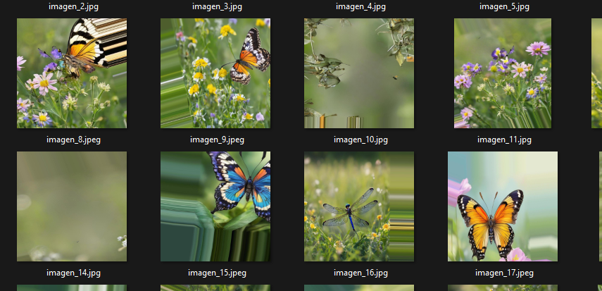
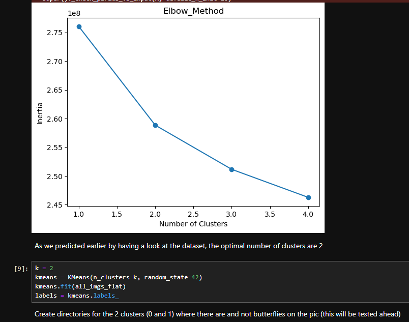
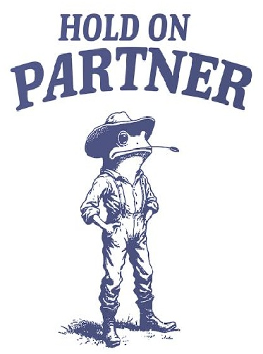
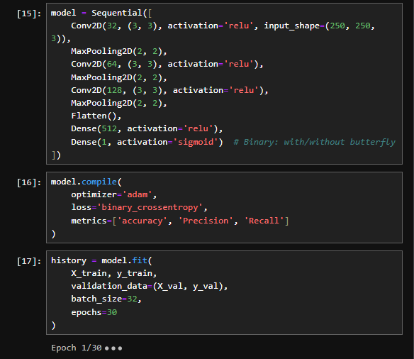
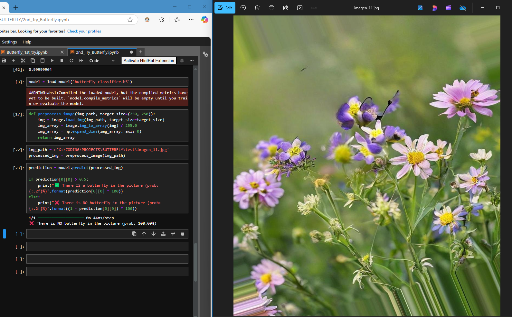
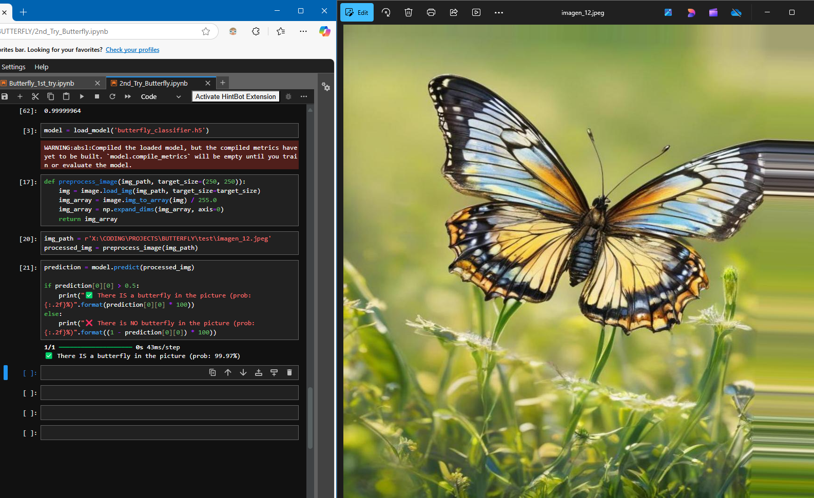

# 🦋 BUTTERFLY CLASSIFIER 🦋
In this repo you will find a CNN which is a Binary classifier. The goal of this project was to detect if there is or not a butterfly in the picture.

At first, when we had a brief look at the dataset, we realize that we do not have either labels or the pictures classified by the presence of a butterfly or not, so we proceed to do the following steps:

* We have a look at the extension of the files, to see if there is any pattern
* After observing that some of the pictures watched with the extension .jpeg are the ones with a butterfly.

* We preprocess the images and once we do have all the imgs normalized and in the same folder with a modified name, we proceed to see how many clusters of imgs we have (we know we should have 2, but, you know, just in case)

* We used the Elbow Method so it would back up our decision whether there are only 2 categories or more in our dataset, and as we can see, the elbow method points that the optimal number of clusters is 2, GREAT.

 

* We proceed then to do a KMeans algorythm so logically if the Elbow Method says that we have 2 clusters, we set the clusters in Kmeans at 2, theorically we should have our imgs clsasified and therefore the only thing left to do is to label them and start with our CNN. But...
 
  
 
 We have a look at some of the imgs we have from both clusters and we see that each of them includes imgs WITH and WITHOUT butterflies, and that is not at all what we want.

* After seeing this, we proceeded to retake the first hint we had regarding the extension of the imgs, so we separated the imgs per extension, get them all in the same folder depending on their extension and start the following process: separate them, rename them, preprocess them, and start our CNN with the following architecture:

 

The result after training the model is the follwing one: 
 
 
[foto de ambas pruebas, las que le mandé a SARA]

So this is it! Here we have our model!
